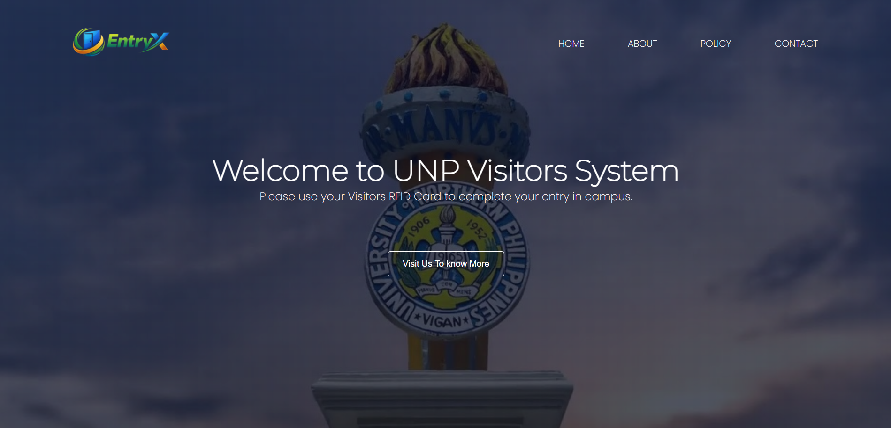

<a name="readme-top"></a>
<br />
<div align="center">
  <a href="https://cjalibin-ops.github.io/EntryX_Main_File/">
    
  </a>
<h1>DCU: Dynamic Convergence University Website
</h1>
<a href="">Visit the Website »</a>
<br >
  <br>
·
<a href="README.md">Report Bug</a>
·
<a href="README.md">Request Feature</a>
  </p>
</div>
<br>

[![Product Name Screen Shot][product-screenshot]](https://cjalibin-ops.github.io/EntryX_Main_File/)

# About The Project

UNP Visitors RFID Entry System helps monitor campus visitors, track entry and exit activity, and improve campus security.

# Getting Started

_To get started with this project, follow these steps :_
<br>

- **Clone** the repository:

   ```bash
   git clone 

- **Add This repo as Remote**  :

   ```bash
   git remote add origin 

- **Add your DEV branch** on your local system :

   ```bash
   git checkout -b DEV/{your_name}/{in which you working on}

- **push your changes** to this branch :

   ```bash
    git push --set-upstream origin DEV/{your_name}/{in which you working on}

# License

Distributed under the MIT License. See `LICENSE.txt` for more information.


<!-- CONTACT -->

# Contact

- Name - <a href="">Ranit Kumar Manik</a>

- Email - ranitmanikofficial@outlook.com

- Project Link - [EntryX-Website]()


[product-screenshot]: Images/screenshot.png
